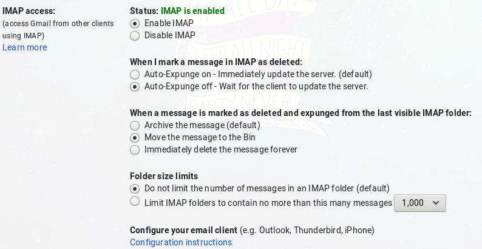

# Email Bulk Delete

## Overview

This Python program is my first program to come to fruition  
This program uses a variety of imported libraries to load in emails from the specified email address and deletes a large number of emails

## Setbacks

This program does not delete all emails relating to email address however and only uses Gmail accounts. The reason behind the program not being able to delete all emails is unknown to me, however changing the IMAP settings in your gmail settings allows the program to delete most of your emails.

## Changing Gmail Settings

IMAP settings must be allowed in the account, and options that allow auto-expunge off, and move messages to the bin

  
Since this program utilises the IMAP Client Python library, it requires the IMAP settings to be enabled.

## Program Features

Program allows email addresses to be chained together so that many emails from different email addresses can be deleted

Help option in GUI gives additional information

## Config

>[email info]  
from_email = ******* -- The email address being used  
>
>[email sens info]  
app_pass = **** -- The app password that can be generated by google for this program; I wouldn't keep this password out and about however  

## Imports

ConfigParser  
ImapLib  
PrettyPrint  
Sys  
OS  
Pyzmail  
Numpy  
IMAP Client  
Default Dict

